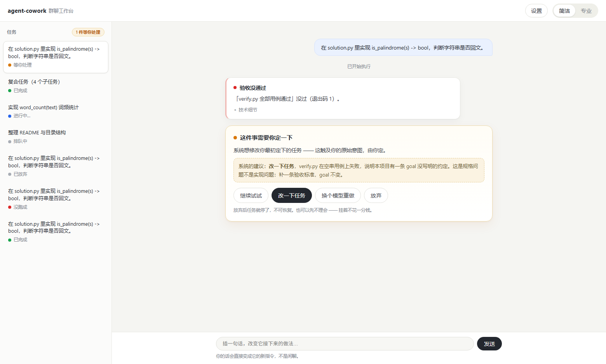

# agent-cowork —— 多 Agent 协作系统

一个多 Agent 协作系统的研究原型：**一句话目标进去，系统自己拆解、并行执行、
跑偏了停下来改规格、再从 checkpoint 恢复**——全过程可以在浏览器界面上看着跑。

核心验证链路：**L0 硬信号 → 中断 → 架构师改规格（REBASE）→ 恢复**。



> ⚠️ 这是一个**给个人在本机使用的研究原型**，不是可以对外提供服务的东西。
> 具体边界见文末[「这个项目不适合做什么」](#这个项目不适合做什么)。

---

## 快速开始

### 方式一：下载 Windows 发布包（不用装 Python）

到 [Releases](../../releases) 下载 `agent-cowork-win-<版本>.zip`：

1. 解压到任意目录
2. 双击 `start.bat`
3. 浏览器自动打开 `http://127.0.0.1:8000`

发布包内置了 Python 运行时和全部依赖（`fastapi` / `uvicorn` / 各家模型 SDK），
**不需要安装任何东西，也不需要联网**。界面设置页里直接填模型 key 就能接真实模型。

### 方式二：从源码跑（需要 Python ≥ 3.11）

```bash
pip install -e .
cowork demo                    # 脚本后端，确定性、不花钱，跑通完整链路
```

第一次跑不需要 key，也不需要 Docker。想确认这台机器上还缺什么：

```bash
cowork models                  # 各家 key 配了没有 / 模型 id 对不对 / PG 与 Docker 在不在
```

没配 key 就打真实供应商时，它会**当场告诉你少了哪一步**，而不是让你撞一个
看起来像账号问题的 401。

---

## 接真实模型

`.env` 里填一个 key（`cp .env.example .env`），或者在界面设置页里填（key 只写不读）：

```bash
cowork demo --backend deepseek            # 真实模型跑同一个场景
cowork plan "把 CSV 转成带图表的周报" --run  # 一句话 → 拆解 → 分层并行执行 → 跑到产出
cowork composite --backend deepseek       # 复合任务：并行 + 冲突检测
```

支持 **9 家供应商**（deepseek / kimi / openai / gemini / qwen / zhipu / xai / doubao /
anthropic）+ litellm 代理，端点、key 变量名、默认模型都在 `cli.PROVIDERS` 一张表里
（共 10 行）。

花钱有上限：`--budget` 默认 100 万 token，超了就升级给人而不是闷头烧钱
（`0` 关闭）。

### 带界面跑

```bash
pip install -e .[server]
cd ui && npm install && npm run build && cd ..
cowork serve                              # http://127.0.0.1:8000
```

`serve` **只绑 loopback**，绑别的地址会被直接拒绝——这是故意的，见文末。

### 跑测试

```bash
docker compose up -d postgres litellm     # 可选，不起就 skip 掉相关的
python -m unittest discover -s tests -t .
```

548 个测试。三样基础设施（Postgres / LiteLLM / Docker）都不起时，依赖它们的
18 个会 skip（7 PG + 5 LiteLLM + 6 Docker），再加 1 个要搜索 key = 19，其余照常跑；
打真实供应商的用例需要 `.env` 里配 key。

---

## 系统架构

拆解层与执行层**共用同一个架构师**——它是全系统唯一的写入决策点
（模型只填它有权决定的字段：goal / 验收标准 / scope / 依赖）。拆解层的
**复核者是顾问（无写权）**，**人是仲裁者**；执行层里 Subagent 是薄执行层，
Runtime 是纯确定性层（不含任何 LLM 调用）。

```text
┌───────────────────────────────────────────┐
│    人（仲裁者）                           │
│    搞不定时才来问你，你拍板               │
└───────────────────────────────────────────┘
                       │
                       ▼ 你拍板 / 搞不定上报
┌───────────────────────────────────────────┐
│    架构师（唯一的拍板人）                 │
│    ┌──────────┐  ┌──────────┐             │
│    │  生成者  │→ │  复核者  │             │
│    │  拆任务  │→ │  挑毛病  │             │
│    └──────────┘  └──────────┘             │
│    执行层：出问题就决定——                 │
│            改要求 / 接着跑 / 放弃         │
└───────────────────────────────────────────┘
                       │
                       ▼ 派发小任务
┌───────────────────────────────────────────┐
│    Subagent ×2–6（并行干活）              │
│    ┌─────────┐ ┌─────────┐ ┌─────────┐    │
│    │  任务1  │ │  任务2  │ │  任务3  │    │
│    └─────────┘ └─────────┘ └─────────┘    │
│    每个小任务一个执行者                   │
└───────────────────────────────────────────┘
                       │
                       ▼ 干活 / 出问题上报
┌───────────────────────────────────────────┐
│    Runtime（执行环境）                    │
│    沙箱跑代码 · 出问题发信号              │
└───────────────────────────────────────────┘
                       │
             出问题信号回到架构师
```

---

## 功能一览（M0–M11 全部完成）

| 里程碑 | 内容 |
|---|---|
| M0 | 核心链路验证：L0 硬信号 → 中断 → REBASE → 恢复 |
| M1 | 真实环境收口：Postgres / Docker 沙箱 / 真实模型 / virtual key 预算强制 |
| M2 | 参数实测：75 次真实运行，`policy.py` 的参数全部有依据 |
| M3 | PROBE 模式：让出控制权而非中断，成本 1.45x 已量化 |
| M4 | 并行与冲突检测：复合任务分层执行 + 产出冲突仲裁 |
| M5a | 停止判断：判别力 Youden J 0.12 → 0.60 |
| M5b | 拆解复核：结构层（确定性）+ 语义层（验收标准反推） |
| M6 | 群聊界面层：React 前端（一套界面 + 设置页）+ FastAPI 服务层 |
| M7 | 拆解三角色：生成者 / 复核者 / 人，一句话目标 → 可执行子任务集 |
| M8 | 写入侧复核：架构师改 spec 前让独立复核者看一眼，默认开 |
| M9 | 会话级 token 硬护栏：应用层预算强制，不依赖 LiteLLM |
| M10 | 工作区与「接手已有项目」、按角色选供应商、工具面 4→8（search_web 是第 9 个） |
| M11 | 真人实测一轮：三角色附加提示词、run 白名单放宽、max_steps 默认 60、进度落成事件 |

## 四条架构不变量（有测试守着）

| 不变量 | 落地位置 | 测试 |
|---|---|---|
| 执行层中心化，Subagent 之间无通信 API | 并行度加在 `scheduler.py`，上游产出经调度器注入 | `test_scheduler` |
| Runtime 不含 LLM，硬信号全部确定性产生 | `runtime/` 整个包无模型调用 | `test_chain` |
| step 循环自己持有，外部抢占 = 循环开头一次状态检查 | `runtime/loop.py` | `test_preemption` |
| checkpoint 里 produced / reasoning_trace 是两个顶层键 | `types.AgentContext` + DB CHECK | `test_chain` + `test_postgres_store` |

## 技术栈

- **零必需依赖**：`pyproject.toml` 的 `dependencies = []`，`anthropic` / `openai` /
  `psycopg` / `fastapi` 全是可选 extra、全部延迟导入。模型不走 SDK 的工具调用循环，
  用结构化输出直接返回「下一个动作」，控制流归系统持有。
- 存储：SQLite（默认，零依赖）/ Postgres（正式，`docker-compose.yml` 起）。
- 沙箱：本地白名单 / Docker 容器（workspace 只读挂载 + scope 内可写 + `--network none`）。
- 前端：`ui/`（React 18 + TS + Vite，一套界面，自带 mock API）。

## 目录结构

```
src/cowork/
  types.py            TaskSpec 硬约束在 __post_init__
  signals.py          信号协议
  policy.py           待验证参数集中在这里（全部有实测依据）
  escalation.py       不经 LLM 的确定性升级下限
  resume.py           RESUME / REBASE / RESTART
  orchestrator.py     状态机
  runtime/            确定性层：bus / sandbox / detectors / loop（无 LLM）
  agent/              architect（唯一写入决策点）/ subagent（薄绑定层）
  llm/                Backend 协议 + 9 家供应商后端 + 预算护栏
  store/              sqlite / postgres
  plan.py             拓扑分层 / 可分解性 / 静态冲突（全确定性）
  scheduler.py        并行调度 + 产出层冲突检测 + 仲裁
  workspace.py        工作区：路径校验 + 产物落点 + 接手快照
  skills.py           人写的说明书：扫目录 + 解析 SKILL.md + 拼进提示词
  server/             M6 服务层：FastAPI + SSE + restore 路径
  views.py            界面层投影
  bench/              实测工具（不参与生产链路）
ui/                   M6 前端（React + TS + Vite）
packaging/            Windows 发布包打包脚本
```

## 文档

- [`多Agent协作系统-开发文档.md`](多Agent协作系统-开发文档.md) —— 主线：设计与全部实测记录
- [`M6-界面层接口.md`](M6-界面层接口.md) —— 给界面层那一侧的接口约定
- [`ui/README.md`](ui/README.md) —— 前端细节

仓库根的 `*.jsonl` 是历次跑批的原始记录，`policy.py` 的参数依据全在里面。

---

## 这个项目不适合做什么

**不要把它服务化给多个人用。** 没有认证、没有多用户概念——`HumanGate` 不知道
「哪个人」在回答，而设置页能读写 `.env` 里的各家 API key。这三件事叠在同一个
HTTP 面上，暴露到回环之外就等于交出账号。所以 `serve` 绑非回环地址会**直接拒绝
启动**。真要多人用，需要的是认证 + 权限模型，不是一个开关。

**成本护栏是粗的。** 应用层 `--budget` 是「停下来的水位线」不是「总额不会超过」
（最多会超出一次调用的量）。要按次预扣得上 LiteLLM virtual key。

**架构师是唯一写入决策点，它的复核循环是新的。** M8 的写入侧复核默认开
（26 个用例上 J 0.963 / FPR 0/24），但「复核驳回 → 架构师重做 → 第二版更好吗」
这一段在真实链路上还没跑过多少次。

**服务层是单进程的。** 服务重启会丢还没派发的拆解（已派发的任务在库里，不受影响）。

## 还没做

| 项 | 状态 |
|---|---|
| 写入侧复核的重做循环 | 判别力已实测，重做段只在真实链路上刚开始跑 |
| 「拆出来的东西合起来能不能跑」 | 风险 #16：结构层查交集与环、语义层查覆盖，都不问这个 |
| 拆解质量没有无偏度量 | 「复核放行率」会被拆解粒度带偏 |
| 7 家供应商未验证 | 只有 deepseek / kimi 用真 key 打通过，其余是照文档抄的预设（`PROVIDERS` 表里 `verified` 记的就是这件事） |
| PROBE 的收益 | 27 次探查 0 次命中，需要一个会可靠漂移的任务来标定 |

---

## License

[GPL-3.0](LICENSE)
